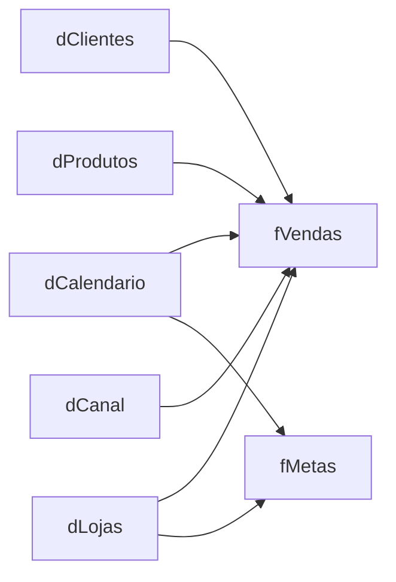

# Retail Sales Analytics — Power BI

Projeto end-to-end de **Business Intelligence** desenvolvido para analisar desempenho comercial de uma operação de varejo com dados sintéticos.

A solução cobre o fluxo completo de BI: **tratamento de dados com Power Query, modelagem dimensional em esquema estrela, criação de medidas DAX, análise de KPIs, construção de dashboards interativos e validação dos resultados**.

## Dashboard

### Visão Geral Executiva


## Principais KPIs

| Indicador | Resultado |
|---|---:|
| Receita Total | **R$ 23,22 Mi** |
| Lucro Total | **R$ 4,53 Mi** |
| Margem Global | **19,50%** |
| Pedidos Únicos | **8.700** |
| Ticket Médio | **R$ 2.669,26** |
| Crescimento da Receita 2025 vs. 2024 | **20,32%** |

Os valores acima foram conferidos após o processo de limpeza e validação dos dados.

## Objetivo do projeto

Construir uma solução analítica capaz de responder perguntas como:

- Como receita, lucro e margem evoluem ao longo do tempo?
- Quais categorias e produtos mais contribuem para o resultado?
- Quais regiões, estados, canais e clientes possuem maior participação?
- Como cada loja performa em relação às metas comerciais?
- Qual foi o crescimento da receita entre 2024 e 2025?
- Quais lojas apresentam maior ou menor atingimento de meta?

## Principais insights

A análise validada do conjunto de dados mostrou que:

- a receita de **2025 cresceu 20,32% em relação a 2024**;
- **Eletrônicos** foi a categoria com maior receita;
- o **Sudeste** foi a região com maior receita;
- a participação dos canais digitais passou de **55,51% em 2024 para 60,99% em 2025**;
- o relatório permite comparar receita, lucro e metas por loja, além de identificar unidades acima e abaixo dos objetivos comerciais.

> Os dados são sintéticos e foram criados exclusivamente para fins educacionais e de portfólio.

## Processo de desenvolvimento

O projeto foi estruturado em cinco etapas principais:

1. **Preparação dos dados** — importação dos arquivos CSV e tratamento no Power Query.
2. **Qualidade dos dados** — remoção de duplicidades, tratamento de valores nulos e padronização de campos textuais.
3. **Modelagem** — criação de um modelo dimensional em esquema estrela.
4. **DAX** — desenvolvimento de medidas de receita, custos, lucro, margem, metas, variações temporais e indicadores YTD.
5. **Visualização e validação** — construção das quatro páginas do dashboard e conferência dos resultados esperados.

## Qualidade e tratamento dos dados

O conjunto foi criado com imperfeições intencionais para simular uma etapa real de preparação de dados.

Entre os tratamentos realizados:

- remoção de duplicatas em `fVendas` utilizando `VendaID`;
- preenchimento de valores nulos em `Desconto`;
- padronização de espaços e variações de caixa em atributos textuais;
- conversão e validação dos tipos numéricos;
- validação das chaves utilizadas nos relacionamentos.

### Volume do conjunto

- **15.513** linhas no arquivo bruto de vendas;
- **15.485** linhas válidas após a remoção das duplicatas;
- **2.500** clientes sintéticos;
- **120** produtos;
- **12** lojas;
- **4** canais;
- **288** registros mensais de metas.

## Modelo de dados

O modelo utiliza duas tabelas fato e dimensões compartilhadas.



### Estrutura principal

- **fVendas** — fato de vendas em nível de item do pedido;
- **fMetas** — metas mensais por loja;
- **dClientes** — dimensão de clientes;
- **dProdutos** — dimensão de produtos;
- **dLojas** — dimensão de lojas;
- **dCanal** — dimensão de canais;
- **dCalendario** — dimensão de datas criada no Power BI.

Os relacionamentos utilizam direção de filtro das dimensões para as tabelas fato.

## Medidas DAX

Foram criadas medidas para acompanhar desempenho financeiro, comercial e temporal, incluindo:

- Receita Bruta e Receita Total;
- Custo Total e Lucro Total;
- Margem %;
- Quantidade Vendida;
- Total de Pedidos;
- Ticket Médio;
- Clientes Ativos;
- Meta de Receita e Meta de Lucro;
- Atingimento de Meta %;
- Diferença para Meta;
- Receita do Mês Anterior;
- Crescimento MoM %;
- Receita do Ano Anterior;
- Crescimento YoY %;
- Receita YTD e Lucro YTD.

Exemplo:

```DAX
Crescimento YoY % =
DIVIDE(
    [Receita Total] - [Receita Ano Anterior],
    [Receita Ano Anterior]
)
```

A lista completa está em [docs/DAX_MEASURES.md](docs/DAX_MEASURES.md).

## Páginas do relatório

### 1. Visão Geral Executiva

Consolida os principais indicadores comerciais e apresenta evolução temporal, desempenho por categoria, região e canal, além da comparação entre receita e meta.


### 2. Produtos & Categorias

Analisa receita, lucro, margem e quantidade vendida por produto, categoria e marca.


### 3. Clientes & Mercado

Explora clientes ativos, ticket médio, receita por região, estado, canal, faixa etária e principais clientes.


### 4. Performance Comercial & Metas

Compara receita realizada e meta, mede o percentual de atingimento e permite analisar o desempenho de cada loja.


## Estrutura do repositório

```text
retail-sales-analytics-powerbi/
├── Retail Sales Analytics.pbix
├── Retail Sales Analytics.pbip
├── Retail Sales Analytics.Report/
├── Retail Sales Analytics.SemanticModel/
├── data/
│   └── raw/
├── docs/
│   ├── DAX_MEASURES.md
│   ├── DICIONARIO_DADOS.md
│   ├── INSIGHTS_VALIDACAO.md
│   ├── MODELO_DADOS.md
│   └── POWER_QUERY_PLAN.md
├── screenshots/
│   └── final-refinement/
└── README.md
```

## Como abrir o projeto

### Opção rápida

Abra o arquivo:

```text
Retail Sales Analytics.pbix
```

no **Power BI Desktop**.

### Projeto versionável

Para explorar a estrutura completa do projeto, abra:

```text
Retail Sales Analytics.pbip
```

O formato PBIP mantém o relatório e o modelo semântico em arquivos versionáveis, permitindo inspecionar a estrutura do projeto diretamente pelo GitHub.

## Documentação

- [Medidas DAX](docs/DAX_MEASURES.md)
- [Dicionário de dados](docs/DICIONARIO_DADOS.md)
- [Modelo de dados](docs/MODELO_DADOS.md)
- [Plano de tratamento no Power Query](docs/POWER_QUERY_PLAN.md)
- [Valores de validação e insights](docs/INSIGHTS_VALIDACAO.md)

## Tecnologias e conceitos

**Power BI · Power Query · DAX · Modelagem Dimensional · Star Schema · Data Cleaning · Data Visualization · Business Intelligence · Git · GitHub**

## O que este projeto demonstra

Este projeto foi desenvolvido para demonstrar, na prática, competências em:

- preparação e transformação de dados;
- modelagem dimensional;
- criação e validação de métricas de negócio;
- análise exploratória e interpretação de indicadores;
- desenvolvimento de dashboards;
- organização e documentação de projetos de dados;
- versionamento de projetos Power BI com PBIP e Git.

---

Desenvolvido por **Eduardo de Toledo Dias** como projeto de portfólio em Dados & BI.

[Portfólio](https://dudxzz-25.github.io/portfolio-web/) · [GitHub](https://github.com/dudxzz-25)
